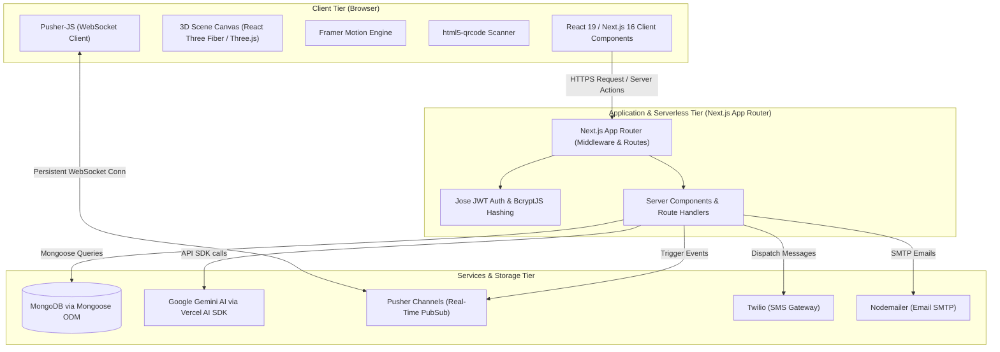

# Ranbhoomi 2.0 Web Platform: Technical Architecture & Interview Preparation Guide

This comprehensive technical reference guide provides an in-depth analysis of the **Ranbhoomi 2.0 Web Platform** tech stack, system architecture, core engineering paradigms, and detailed interview preparation questions. Use this document to prep for technical evaluations, system design reviews, or team onboarding.

---

## 🗺️ Architectural Ecosystem Overview

---

## 🛠️ Complete Tech Stack breakdown

| Technology | Category | Purpose in Ranbhoomi 2.0 | Why it Helps (Technical Value Add) |
| :--- | :--- | :--- | :--- |
| **Next.js 16 (App Router)** | Framework | Core SSR/ISR/CSR Hybrid Web Framework & API Hosting | Eliminates separate frontend/backend hosting; SEO-optimized Server-Side Rendering (SSR); Edge middleware for routing & JWT extraction. |
| **React 19** | UI Library | Component-Driven UI Engine | Utilizes standard declarative components, state management, and brand-new features (e.g., Server Actions, `use` Hook, improved hydration). |
| **MongoDB & Mongoose** | Database / ODM | Primary Database & Schema Validation | Schema-less flexibility for event rules/teams combined with Mongoose's powerful strict schemas, validation hooks, and pre/post middleware. |
| **Tailwind CSS v4** | UI Styling | Modern, Low-Utility Utility-First Styling Engine | Lightning-fast builds, CSS variables integration out of the box, responsive grids, and design consistency. |
| **Three.js & React Three Fiber (R3F)** | 3D Graphics | Interactive 3D graphics, gamified scenes, or immersive dashboards | Allows native declarative WebGL rendering inside the React component lifecycles using components like `<Canvas />` and `@react-three/drei`. |
| **Framer Motion** | Animation | Fluid Micro-interactions, Transitions, and UI physics | Simplifies animating React layouts, exit transitions, gestures (hover/drag), and entry animations. |
| **Vercel AI SDK & `@ai-sdk/google`** | Generative AI | AI Assistant, automatic registration support, and search | Simplifies streams, agent-like tools call logic, and direct interfacing with Google Gemini Large Language Models. |
| **Pusher & Pusher-js** | Real-Time Sync | Live leaderboard updates, event status shifts, matches updates | Eliminates polling overhead through managed hosted WebSockets channels; handles reconnections and scale instantly. |
| **Jose (JWT)** | Cryptography | Stateless Client-side Session Security | Light-weight, high-performance cryptography standard for Edge and Serverless runtimes where Node-native `crypto` might be slow/heavy. |
| **BcryptJS** | Security | Cryptographic Password Hashing | Slow-hashing blowfish-based algorithm that defends against dictionary and brute-force attacks via adaptive work factor rounds. |
| **Twilio & Nodemailer** | Communication | Verification codes, PDF tickets delivery, event alerts | Nodemailer manages direct SMTP transport (e.g., via AWS SES or Gmail) for PDF receipts; Twilio manages SMS messaging pipelines. |
| **@react-pdf/renderer & PDFKit** | Document Gen | Dynamically generated receipts, ID Cards, or event tickets | Fully client/server-side PDF rendering pipeline allowing CSS-like styling directly to printable layout structures. |
| **html5-qrcode & html2canvas** | Scanning / Imaging | Check-in scanning & ticket image captures | Fast browser-based QR/barcode scanning via device camera; `html2canvas` captures DOM nodes to PNG/JPEG for easy sharing. |
| **Recharts** | Analytics | Graphical statistics, registration metrics, event insights | SVG-based responsive charting designed specifically for clean Integration within React components. |

---

## 🧠 Deep Dive: How the Core Languages & Frameworks Work

### 1. Modern JavaScript (ESNext) and Node.js
Ranbhoomi 2.0 is built entirely on modern JavaScript (ESNext).
* **Asynchronous Execution Model:** Node.js runs on a **Single-Threaded Event Loop** powered by Chrome's V8 engine. Asynchronous operations (like querying MongoDB, sending an email via Nodemailer, or calling Gemini API) are offloaded to Node’s background worker threads (libuv thread pool) or operating system APIs, allowing the main thread to handle incoming requests without blocking.
* **Promises & Async/Await:** Provides clean syntax for managing asynchronous flows instead of nested callbacks.
* **ES Modules (`import`/`export`):** Strict, modern modular structure allowing static analysis, tree-shaking, and efficient bundle reduction.

### 2. Next.js 16 & React 19 Architecture
Next.js 16 utilizes the **App Router** framework built on React Server Components (RSC).
* **React Server Components (RSC):** Render on the server by default. 
  * *How they help:* Zero client-side JavaScript overhead for static pages, direct database/secure API querying right in the component, and faster First Contentful Paint (FCP).
* **Client Components (`"use client"`):** Standard React components that hydrate on the browser. Required when adding stateful hooks (`useState`, `useEffect`), interactive handlers (`onClick`), or libraries depending on browser APIs (like `Pusher-js`, `html5-qrcode`, or R3F).
* **React 19 Advancements:**
  * **Server Actions:** Safe, asynchronous RPC-style functions defined on the server and called directly from Client UI forms, eliminating the need to explicitly write fetch endpoints.
  * **The `use` hook:** Reads promises or contexts inline directly during rendering.
  * **Automatic Hydration Improvements:** Fewer layout shifts and native resource loading optimization (fonts, preloading scripts).

### 3. Database Layer: MongoDB & Mongoose
Mongoose is an Object Document Mapper (ODM) that wraps MongoDB.
* **Documents & Collections:** Data is stored in BSON (Binary JSON) documents, mapping perfectly to standard JavaScript objects.
* **Schema Enforcement:** While MongoDB is inherently schema-less, Mongoose enforces rules at the application layer, ensuring strict types, validation constraints, and default values.
* **Index Strategy:** Optimizes high-throughput read operations (like looking up user registration tickets) by defining indexes on key fields (e.g., `email`, `ticketId`).

### 4. Real-time PubSub: Pusher
Rather than keeping standard TCP sockets open on a serverless engine (which Next.js routes cannot do continuously), the app uses a **Managed WebSockets Provider (Pusher)**.
1. The Client connects to Pusher and subscribes to a specific `channel` (e.g., `events-channel`).
2. When a state change happens (e.g., a team scores or gets approved), the Next.js Server sends a secure REST API request to Pusher.
3. Pusher instantly broadcasts this event to all active clients connected to that channel over persistent WebSockets.

---

## 💬 Interview Q&A Preparation: Crack the Technical Rounds

### Q1: Next.js vs. Standard SPA (like React-Vite). Why did we choose Next.js for Ranbhoomi 2.0?
> **Answer:** 
> A standard Single Page Application (SPA) built with Vite serves a blank HTML file and loads a massive JavaScript bundle, which must be compiled and executed on the client side. This causes poor SEO indexability and slow time-to-interactive on mobile devices.
> 
> Next.js provides **Server-Side Rendering (SSR)** and **Incremental Static Regeneration (ISR)**. This ensures search engines can fully crawl our event schedules and guidelines immediately. Additionally, Next.js features **file-system routing, API Route Handlers, and Edge Middleware** in a single codebase. By adopting Next.js, we eliminated the need to maintain, deploy, and secure a separate Express/Node.js API backend, keeping our architecture unified.

### Q2: How does authentication work in this application? Is it stateful or stateless?
> **Answer:** 
> The platform uses a secure, **stateless JWT-based authentication system** powered by the `jose` library. 
> 
> When a user logs in, their credentials are validated against the MongoDB password hash (stored using `bcryptjs` for security). Upon successful validation, the server signs a JSON Web Token (JWT) containing non-sensitive payloads like the user's ID, email, and role. 
> 
> This JWT is stored in an **httpOnly, Secure, SameSite=Strict Cookie** to prevent Cross-Site Scripting (XSS) and Cross-Site Request Forgery (CSRF) attacks. Every API and Page route can verify this token at the edge using Next.js Middleware before processing any database calls. It is stateless because the server doesn't store active sessions in RAM (like Redis or Memcached), allowing infinite scaling.

### Q3: Explain how Three.js and React Three Fiber (R3F) integration works in a React 19 environment.
> **Answer:** 
> Three.js is an imperative WebGL library that manipulates a 3D Scene Graph using cameras, renderers, lights, materials, and geometries.
> 
> React Three Fiber acts as a **React Renderer** for Three.js. Instead of manually writing `scene.add(mesh)` and setting up a manual animation loop via `requestAnimationFrame`, R3F allows us to write standard declarative JSX, e.g., `<mesh><boxGeometry /><meshStandardMaterial /></mesh>`. R3F automatically translates this into imperative Three.js operations and manages a highly optimized animation loop.
> 
> In **React 19/Next.js**, since Three.js depends directly on browser WebGL contexts, we load the 3D Canvas component dynamically using React's `lazy` load or Next.js `dynamic(() => ..., { ssr: false })` to prevent server-side rendering errors. We use `@react-three/drei` for optimized helper components, like OrbitControls and preloaded texture managers.

### Q4: Mongoose provides schemas for MongoDB. How does Mongoose prevent data corruption, and what are standard index designs we use?
> **Answer:** 
> Mongoose prevents data corruption through **schema validation hooks, casting, and pre-save hooks**. Before saving any document (like a team registration), Mongoose validates types, checks custom regular expressions (e.g., verifying phone numbers or email domains), and runs sanitization methods. 
> 
> For indexing, we define:
> 1. **Unique Indexes:** On fields like `email` and `registrationId` to guarantee uniqueness at the database engine level (avoiding race conditions of duplicate sign-ups).
> 2. **Compound Indexes:** On queries filtering by multiple keys (e.g., filtering `eventCategory` + `registrationStatus`). This prevents MongoDB from executing costly full-collection scans, shifting performance from $O(N)$ to $O(\log N)$.

### Q5: How do you handle real-time notifications or leaderboards, and why Pusher instead of raw WebSockets (Socket.io)?
> **Answer:** 
> We use **Pusher** for real-time capabilities. 
> Since Next.js is deployed in serverless, edge, or scalable container runtimes, keeping persistent raw TCP WebSocket connections open directly inside Next.js server instances is difficult and can quickly overwhelm memory or connection pool limits. 
> 
> **Pusher** resolves this by operating as a managed WebSocket-as-a-Service broker. Our Next.js API route handles a fast REST request, fires the new score/leaderboard update to Pusher, and terminates immediately. Pusher handles the persistent sockets, client auto-reconnections, heartbeat checks, and global scalability. 

### Q6: Walk me through the security process of handling password storage and JWT generation.
> **Answer:** 
> 1. **Password Hashing (Signup/Update):** We never store plain-text passwords. We use `bcryptjs` to generate a random cryptographic salt (with 10 hash rounds) and compute the slow Blowfish-based hash of the password.
> 2. **Password Verification (Login):** We extract the stored hash from MongoDB, use `bcryptjs.compare()` to hash the incoming login password using the original salt, and verify the outcome.
> 3. **Session Signing:** Upon matching, we generate a payload. We use `jose` to sign a JWT using an environment-level secret key (`process.env.JWT_SECRET`) using the highly secure `HS256` hashing algorithm. We set an expiration date (e.g., `7d`) and send the token back as an HTTP-only cookie.

### Q7: If a user tries to scan a QR code to check in, how does the frontend coordinate with the backend?
> **Answer:** 
> 1. **Capture:** The Client Component uses the `html5-qrcode` library, capturing the user's camera feed and performing processing loops to decode the visual pattern into text (the ticket registration ID).
> 2. **Transmission:** The decoded ID is sent immediately via a secure POST API request (`/api/check-in`) or a Server Action.
> 3. **Verification:** The backend handler extracts the JWT cookie, verifies that the scanner has admin/moderator roles, queries MongoDB for the matching registration ticket, marks it as `checkedIn: true`, and logs the timestamp.
> 4. **Real-time broadcast:** An event is dispatched to Pusher, updating the live admin attendance dashboards in real-time.

---

## 🚀 Performance Optimization Strategies

If asked how to optimize this exact application for millions of views during a major collegiate sports tournament:
1. **ISR & CDN Caching:** Serve static schedules and guides using Next.js Incremental Static Regeneration (ISR) cached at the edge (Vercel CDN / Cloudflare).
2. **MongoDB Connection Pooling:** Cache the Mongoose connection across serverless invocations to avoid database connection exhaustion.
3. **Lazy Loading 3D Scenes:** Only load Three.js components when the user scrolls them into view, or use standard 2D vector fallback graphics for lower-end mobile devices.
4. **Optimized PDF Generation:** Do not generate PDFs on the fly during registration bottlenecks. Generate the receipt PDF asynchronous via a background queue or offload rendering entirely to the client's browser using `@react-pdf/renderer` inside a Web Worker.
